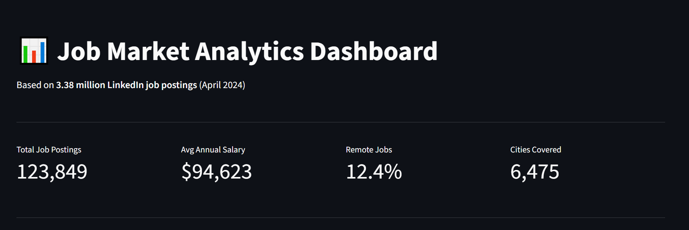
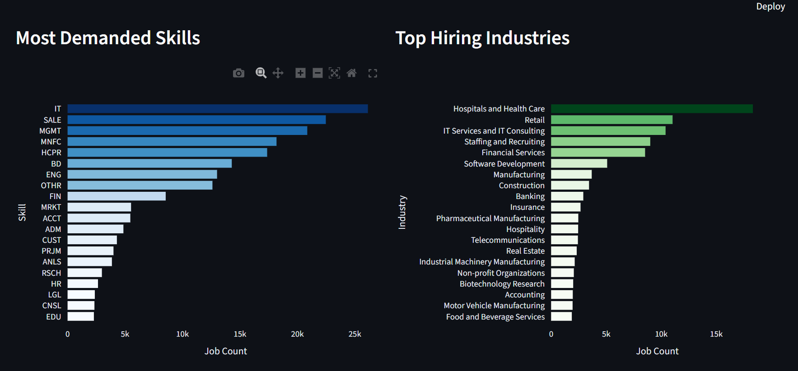
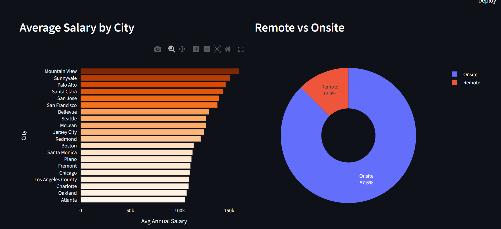
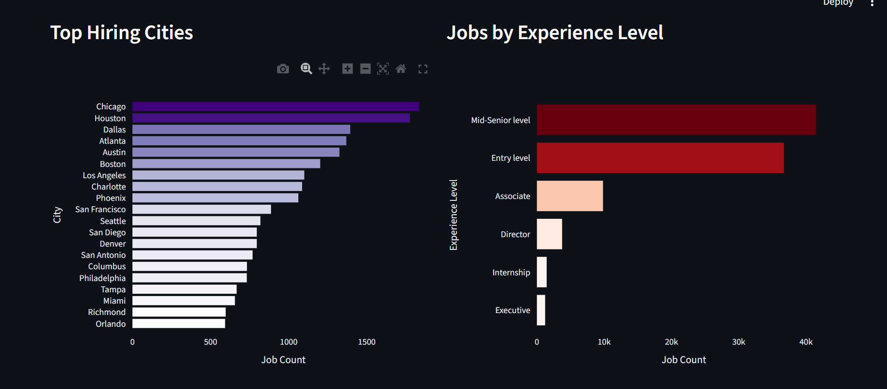
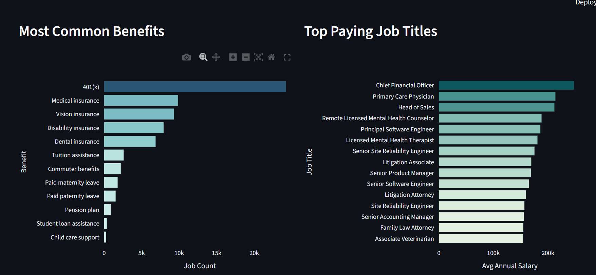
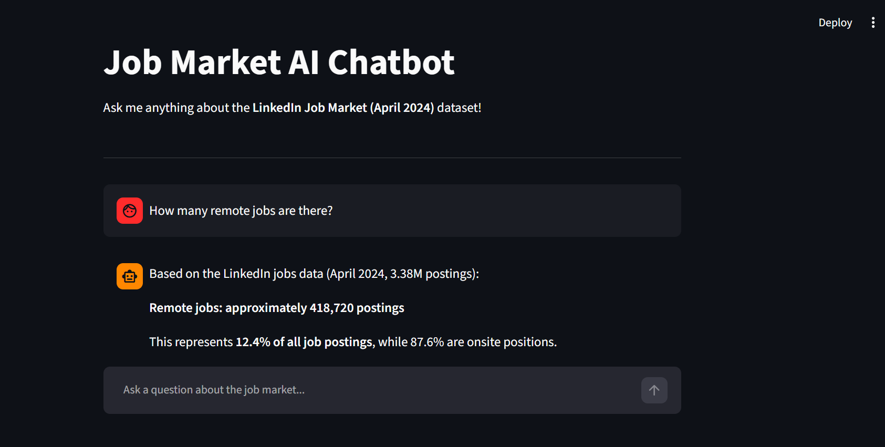

# Job Market Analytics Platform

An end-to-end job market analytics platform built using 3.38 million LinkedIn job postings (April 2024).

## Features
- Data cleaning and preprocessing pipeline
- Analytics on skills, salaries, cities, industries, and more
- Interactive dashboard built with Streamlit and Plotly
- AI chatbot powered by Anthropic Claude API

## Tech Stack
- Python, Pandas, NumPy
- Streamlit, Plotly
- Anthropic Claude API
- Jupyter Notebook

## Dataset
Download the dataset from Kaggle:
https://www.kaggle.com/datasets/arshkon/linkedin-job-postings

Place all CSV files in the `data/` folder before running.

## How to Run

### Install dependencies
pip install -r requirements.txt

### Run the Dashboard
streamlit run dashboard.py

### Run the AI Chatbot
streamlit run chatbot.py

## Screenshots
### Dashboard

### AI Chatbot

## Project Structure
- `01_cleaning.ipynb` — Data cleaning and preprocessing
- `02_analytics.ipynb` — Analytics and insights
- `dashboard.py` — Interactive Streamlit dashboard
- `chatbot.py` — AI-powered chatbot
- `requirements.txt` — Python dependencies
